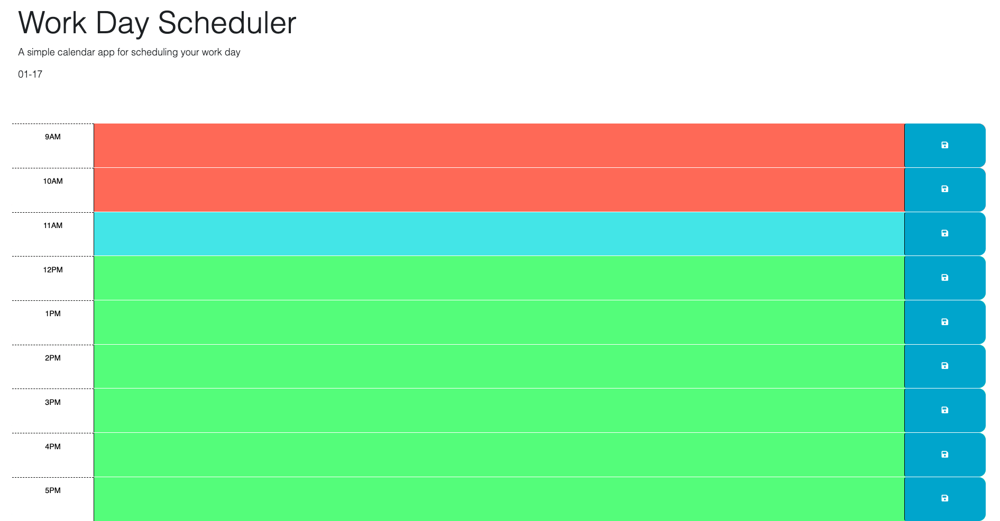

# DayScheduler

work day scheduler

## **Description**

### The purpose of this project was to create a simple work day scheduler/calendar that gives the user the ability to save events for each hour of the day.

 
Link to deployable GitHub page  &nbsp; • &nbsp; (https://connbstro.github.io/ScheduleChallenge/)

 

# Built with

HTML, CSS, and JavaScript

## **Overview**

- Displayed the current day/date at the top of the page and implemented moment.js to automatically update it according to the day/date.
- Created timeblocks that show past present or future.
- Used js functionality to ensure the webpage recoginizes the current time of day
- Implemented event listeners to execute functions such as saving data to localStoarge when the "Save" button is clicked.
- When the page is refreshed the previoius information stays in the local storage.

